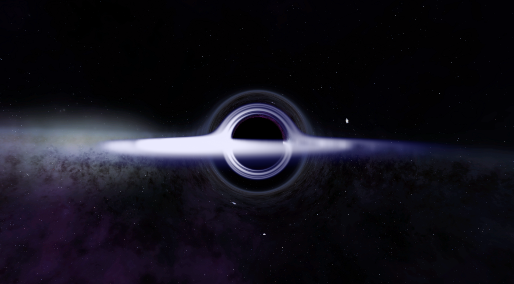

# Schwarzschild-BlackHole-Simulation 施瓦西黑洞模拟

This project provides a real-time, interactive simulation of a Schwarzschild black hole, demonstrating key gravitational phenomena such as gravitational lensing, the accretion disk, and the Doppler effect. The simulation is implemented in two versions: a desktop application using **Python/PyOpenGL** and a web-based version using **JavaScript/WebGL**.

The core rendering logic and shader framework are heavily inspired by and adapted from the excellent C++/OpenGL project [Blackhole by rossning92](https://github.com/rossning92/Blackhole). This project serves as a re-implementation and simplification, focusing on porting the complex shader logic to more accessible platforms like Python and WebGL.A key goal of this re-implementation is to make this complex simulation more accessible and significantly easier to run. While the original C++ project offers high performance, it requires a specific compilation toolchain (like CMake and a C++ compiler). In contrast, these Python and WebGL versions are platform-independent and require no compilation, effectively lowering the system and software requirements for anyone wishing to experience or experiment with the simulation.

The gravitational lensing:


See Einstein ring:

The view from north pole:


## Key Features

- **Gravitational Lensing**: Simulates the bending of light paths around a massive object, causing the background starfield to appear distorted.
- **Accretion Disk**: A glowing, rotating disk of matter orbiting the black hole.
- **Doppler Effect (Relativistic Beaming)**: The side of the accretion disk moving towards the observer appears brighter and blue-shifted, while the side moving away appears dimmer and red-shifted.
- **Event Horizon**: The "point of no return," rendered as a perfect black sphere where no light can escape.
- **Photon Sphere**: At 1.5 times the Schwarzschild radius, light can orbit the black hole. This contributes to the complex visual effects near the event horizon.
- **Real-time and Interactive**: The simulation runs in real-time, allowing for future extensions like camera movement.

## How It Works: The Rendering Pipeline

This simulation doesn't use traditional 3D models. Instead, it employs a **screen-space ray marching** technique executed entirely on the GPU via a fragment shader. Here's a breakdown of the process for each pixel on the screen:

1.  **Backward Ray Tracing**: For every pixel, a light ray is cast *from* the camera *into* the scene. This is more efficient than tracing rays from light sources.

2.  **Numerical Integration**: The path of the light ray is not a straight line due to the black hole's gravity. We simulate its curved path using **Euler integration**. In a loop, we repeatedly update the ray's position and direction based on a simplified formula for gravitational attraction:

    ```glsl
    // This formula calculates the change in the ray's velocity (direction)
    // based on its proximity to the black hole.
    vec3 dr = -1.5 * Rs * ro / dot(ro, ro) / dot(ro, ro);

    // Update velocity and position over a small time step 'dt'
    rd += dr * dt; // rd is the ray direction
    ro += rd * dt; // ro is the ray origin/position
    ```

3.  **Collision Detection & Color Determination**: During the ray marching loop, we check for several conditions:
    - **Fell into Event Horizon**: If the ray's distance to the center is less than the Schwarzschild Radius (`Rs`), it has been captured. The pixel is colored **black**.
    - **Hit the Accretion Disk**: If the ray intersects the `y=0` plane within the disk's radius, we calculate the color based on a texture lookup. The previously mentioned Doppler effect is applied here to modify the color's brightness and hue.
    - **Escaped to Space**: If the ray travels far enough without hitting anything, it escapes the black hole's gravity. The pixel is colored by sampling a background skybox texture using the ray's final direction vector.

This entire process is repeated for every single pixel on the screen, for every frame, resulting in the final, fully rendered image.

## Core Principles & Mathematical Formulas

This simulation is not based on traditional 3D rendering but on the physical phenomena described by **General Relativity**, which are approximated using **numerical methods** within the fragment shader. Below are the key mathematical and physical principles at play.

### 1. Approximation of Light Deflection

In General Relativity, light travels along "geodesics" through spacetime. For a Schwarzschild black hole, this path is curved. Calculating this path precisely requires solving complex geodesic equations. To achieve real-time performance on a GPU, this project uses a highly effective and visually plausible **approximation formula** that simulates the change in a light ray's direction due to gravity.

At each step of the ray marching process, we update the ray's velocity (direction) using the following formula:

$$
\Delta \vec{v} = - \frac{3}{2} R_s \frac{\vec{p}}{|\vec{p}|^4} \Delta t
$$

Where:
- **$$ \Delta \vec{v} $$** is the change in the light ray's velocity (direction vector) over a small time step `$$ \Delta t $$`.
- **$$ R_s $$** is the Schwarzschild Radius, defining the size of the event horizon.
- **$$ \vec{p} $$** is the photon's current position vector relative to the black hole's center.
- **$$ |\vec{p}| $$** is the distance from the photon to the center of the black hole.

This formula is implemented in the GLSL shader as follows:

```glsl
// 'ro' is the ray position vector p, 'Rs' is the Schwarzschild Radius.
// dot(ro, ro) calculates the squared distance |p|^2 for efficiency.
vec3 dr = -1.5 * Rs * ro / dot(ro, ro) / dot(ro, ro);
rd += dr * dt; // 'rd' is the ray direction vector v
```

This gravitational relationship, proportional to `$$ 1/|\vec{p}|^3 $$` (since `$$ \Delta \vec{v} \propto \vec{p}/|\vec{p}|^4 $$`), is a modification of Newtonian gravity (`$$ 1/|\vec{p}|^2 $$`) and effectively models the behavior of photons in a strong gravitational field, including the formation of a photon sphere.

### 2. Numerical Integration: The Euler Method

We use the simplest numerical integration technique—the **Euler Method**—to update the ray's position step-by-step based on the change in velocity calculated above:

$$
\vec{v}_{i+1} = \vec{v}_i + \Delta \vec{v}
$$
$$
\vec{p}_{i+1} = \vec{p}_i + \vec{v}_{i+1} \cdot \Delta t
$$

This is precisely what occurs inside the `for` loop. By iterating hundreds of times, we construct a smooth, curved path for the light ray.

### 3. Doppler Effect & Relativistic Beaming in the Accretion Disk

The variation in the color and brightness of the accretion disk is caused by a combination of the **Doppler Effect** and **Relativistic Beaming**.

- **Doppler Effect**: When matter moves towards us, the frequency of the light we receive increases (blueshift), making it appear brighter. When it moves away, the frequency decreases (redshift), making it appear dimmer.
- **Relativistic Beaming**: At near-light speeds, light emitted by an object becomes highly concentrated in its direction of motion. This makes the matter moving towards us appear significantly brighter.

A simplified formula is used in the shader to model this combined effect, calculating a `doppler` factor to adjust the color's brightness:

$$
\text{dopplerFactor} = \frac{1}{1 + v_{disk} \cdot v_{orbit} \cdot \vec{v}_{ray} \cdot \hat{x}}
$$

Where:
- **$$ v_{orbit} $$** is the orbital velocity of the disk at a given point.
- **$$ \vec{v}_{ray} \cdot \hat{x} $$** is the projection of the final ray direction onto the disk's direction of motion (simplified here as the x-axis).

This factor is multiplied by the color sampled from the accretion disk texture, creating the visual effect where the side moving towards us is brighter (blueshifted) and the side moving away is dimmer (redshifted).

### 4. Accretion Disk Texture Mapping

To map the 3D collision point of the light ray onto the 2D accretion disk texture, we use a **Cartesian to Polar coordinate conversion**.

$$
r = \sqrt{p_x^2 + p_z^2}
$$
$$
\theta = \text{atan2}(p_x, p_z)
$$

The resulting radius `r` and angle `θ` are then used as the `(u, v)` coordinates to sample the correct color from the disk texture.

---

## Implementations

This repository contains two separate implementations of the same shader logic.

### 1. Python / PyOpenGL Version

-   **Location**: Root directory (`/`)
-   **Description**: A desktop application that uses `PyOpenGL` for OpenGL bindings, `pygame` for window and event handling, and `numpy` for numerical operations.
-   **Dependencies**: `PyOpenGL`, `pygame`, `numpy`

### 2. JavaScript / WebGL Version

-   **Location**: `web/` directory
-   **Description**: A client-side web version that runs in any modern browser supporting WebGL. It uses minimal JavaScript to set up the canvas and run the GLSL shader.
-   **Dependencies**: A modern web browser.

## Acknowledgments

This project is a learning exercise and a tribute to the incredible work of **@rossning92**.

-   **Original Project**: [rossning92/Blackhole](https://github.com/rossning92/Blackhole)
-   The core GLSL shader logic, the ray marching algorithm, the physics formulas for gravitational lensing, and the overall rendering strategy are directly based on his excellent C++ implementation. My main contribution is the successful porting and adaptation of this logic into Python/PyOpenGL and JavaScript/WebGL environments.

---

## License

Distributed under the MIT License. See `LICENSE` for more information.


